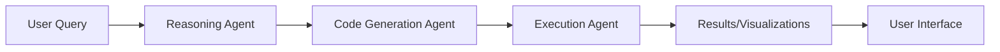

# Data Analyst Agent - Proof of Concept

An AI-powered data analysis assistant using a multi-agent architecture to analyze CSV files and generate insights.

## Overview

This PoC demonstrates an intelligent data analysis system where multiple specialized AI agents collaborate to understand user queries, generate analysis code, and execute it to produce insights and visualizations.

## Architecture

```
User Query → Reasoning Agent → Code Generation Agent → Execution Agent → Results
```

### Agents

1. **Reasoning Agent** - Understands user intent and breaks down complex queries
2. **Code Generation Agent** - Generates Python code for data analysis
3. **Execution Agent** - Safely executes generated code
4. **Insights Agent** - Provides automatic data insights upon upload

## Features

- Automatic data profiling and insights
- Natural language query interface
- Automatic visualization generation
- Interactive chat with your data
- Multi-file support

## Tech Stack

**Backend:**
- FastAPI for REST API
- OpenAI GPT for agent intelligence
- Pandas for data manipulation
- Custom agent orchestration

**Frontend:**
- Streamlit for interactive UI
- Plotly for visualizations
- Matplotlib/Seaborn for plotting

## Setup

### Prerequisites

- Python 3.9+
- OpenAI API key

### Installation

```bash
# Install dependencies
pip install -r requirements.txt

# Set up environment variables
cp .env.example .env
# Edit .env and add your OpenAI API key
```

### Running the Application

**Start Backend:**
```bash
cd backend
python main.py
# Backend runs on http://localhost:8000
```

**Start Frontend:**
```bash
cd frontend
streamlit run main.py
# Frontend runs on http://localhost:8501
```

## Usage

1. **Upload CSV Files**: Drag and drop your CSV files in the left panel
2. **Get Automatic Insights**: View instant data analysis
3. **Ask Questions**: Use natural language to query your data
   - "Show me the distribution of sales by region"
   - "What are the top 5 products by revenue?"
   - "Create a correlation heatmap"
4. **View Results**: See generated code, execution results, and visualizations

## Project Structure

```
PoC/
├── backend/
│   ├── main.py                 # FastAPI application entry
│   ├── routes/
│   │   ├── reasoningagent.py   # Query understanding
│   │   ├── codegenerationagent.py  # Code generation
│   │   ├── executionagent.py   # Code execution
│   │   └── insights.py         # Data insights
│   ├── tools/
│   │   ├── query_understandingtool.py
│   │   ├── code_writingtool.py
│   │   ├── dataframe_summary.py
│   │   └── plot_codegenerator.py
│   └── models/
│       ├── single_csv.py       # Data models
│       └── test_react.py       # Agent orchestration
├── frontend/
│   └── main.py                 # Streamlit UI
└── requirements.txt
```

## Agent Workflow



## Key Components

### Reasoning Agent
Analyzes user queries to understand:
- Intent (plotting, statistics, filtering)
- Required columns
- Analysis type needed

### Code Generation Agent
Generates safe, executable Python code:
- Pandas operations
- Matplotlib/Seaborn visualizations
- Statistical analysis

### Execution Agent
Executes code in a controlled environment:
- Sandbox execution
- Error handling
- Result capturing

## Example Queries

- "What's the average value by category?"
- "Show a scatter plot of X vs Y"
- "Find outliers in the price column"
- "Group by region and show total sales"

## Limitations (PoC)

- Single CSV per query
- Limited to Pandas operations
- No persistent storage
- Synchronous execution

## Future Enhancements

- [ ] Support for multiple file types (Excel, JSON, SQL)
- [ ] Persistent chat history
- [ ] Advanced statistical analysis
- [ ] Export analysis reports
- [ ] Collaborative features
- [ ] Custom agent training

## Development Notes

This is a **Proof of Concept** demonstrating:
- Multi-agent architecture feasibility
- Natural language to code generation
- Safe code execution patterns
- Interactive data analysis workflow
